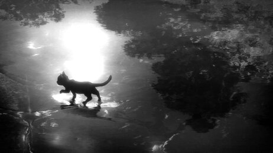

<h1 align="center">
    
</h1>

<h3 align="center">An Native Android Developer from Brazil 🟢🟡🔵🟡🟢</h3>

  
 

 
 🔭 I’m currently studying information systems at the federal institute of Rio de Janeiro
 
 🌱 I’m currently learning about **Android Native Development**

⚡ Fun fact: **I love BMX**

 

  
 

 
  
  
  

